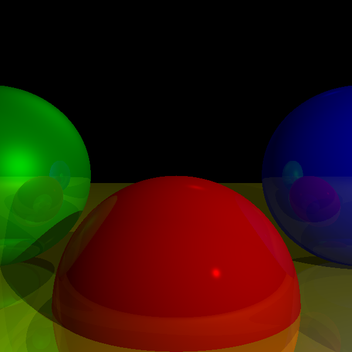

### Simple raytracing implementation

This projects is split in branches to recreate the original order of the book:

- Simple Raytracing
- Lights 1 | Diffuse 
- Lights 2 | Specular
- More soon...

Notes of RayTracer implementation

- Excercises from Graphics from scratch.
